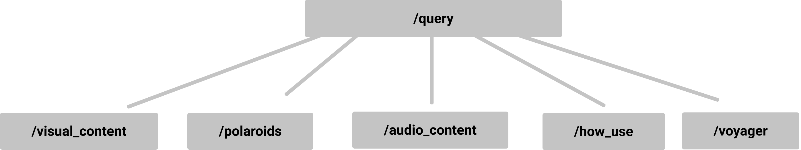

# The Golden Record - Back End

## 🎓Disclaimer

This project has been created for educational purposes as part of the Bachelor's curriculum of the HETIC school. The contents presented have not been the subject of a request for right of use. **This site will and should in no case be used for commercial purposes and will not be published.**

## 🛰️ Project Overview

This repository is a back-end application for a web documentary on the Golden Record and has a database and an API. It is deployed on this url https://custom-pcvp.frb.io/.

## 📄 Getting Started


### Installing

Clone the repository, and install the dependancies

```
git clone $url
```

```
cd docWeb-voyager-back-end
```

```
composer install
```

## 🚚 Routes
<p align="center">
  
</p>

All queries to the api must be done starting from the */query* route

|/query                |action                                                  |
|----------------|-------------------------------|
|/visual_content| get all urls for images in **Gallery** section                    
|/polaroids          |get all info for cards in **Team** section     
|/audio_content          |get all infos for sounds in **Sounds** section 
|/how_use          | get all info for overlays in **Symbols** section  
|/voyager         | get all info for texts in **Origin** section

### example 
```shell
https://custom-76fy.frb.io/query/visual_content
```
Return a JSON object with all urls images from the Gallery section

## 🔨 Built with

Composer - [documentation](https://getcomposer.org/doc/)  
Slim - [documentation](http://www.slimframework.com/)  


## 🔗 Related repositories
[Front-end](https://github.com/RedaHamouche/WebDocVuejs)   
[Back-office](https://github.com/bastien17-dev/docWeb-voyager-back-office) 


## 👥 Contributers

Bastien Paquier - [bastien17-dev](https://github.com/bastien17-dev)  
Quentin Grancher - [quentingrchr](https://github.com/quentingrchr)


